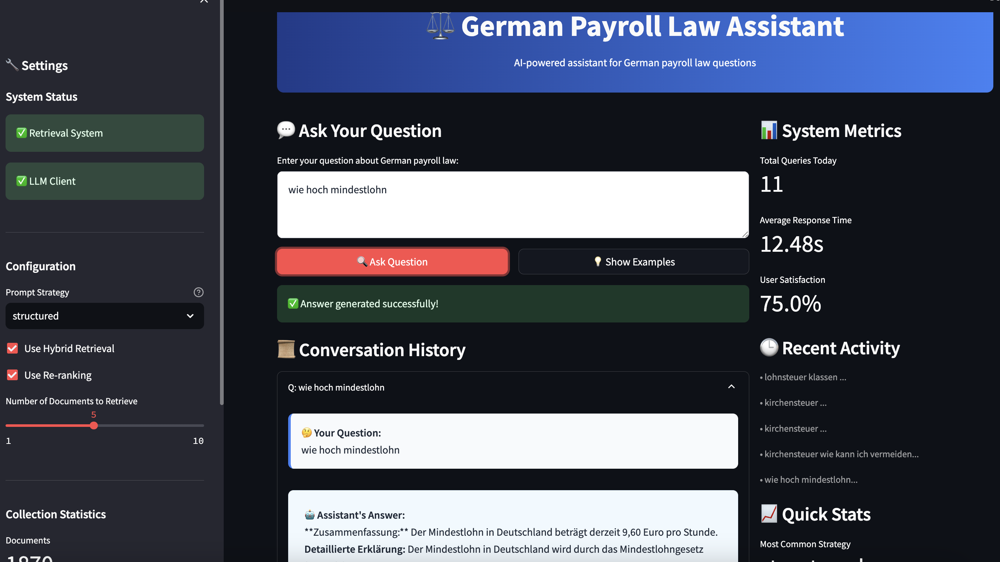
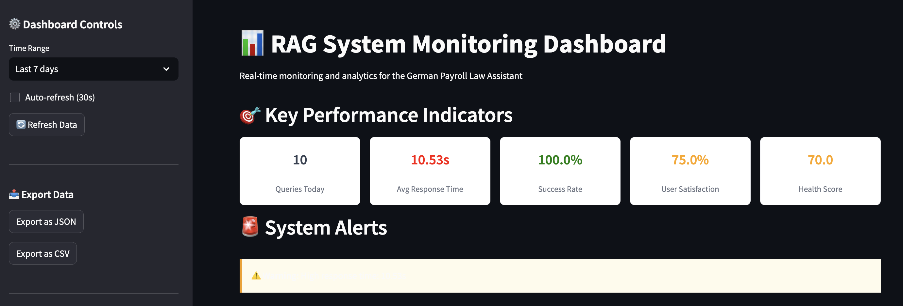

# German Payroll Law RAG Assistant

[](https://www.python.org/downloads/)
[](https://www.docker.com/)
[](https://streamlit.io/)
[](https://opensource.org/licenses/MIT)

An end-to-end Retrieval-Augmented Generation (RAG) application that provides accurate, context-based answers to questions about German payroll law using PDF documents as the knowledge base.

## 🎯 Features

- **📄 PDF Document Processing**: Automated parsing and chunking of legal documents
- **🔍 Hybrid Retrieval**: Combines vector search, keyword search (BM25, TF-IDF), and re-ranking
- **🤖 Multiple Prompt Strategies**: Various approaches for legal Q&A optimization
- **📊 Comprehensive Evaluation**: Metrics for retrieval precision and answer quality
- **🖥️ Streamlit Interface**: User-friendly web interface with document context display
- **📈 Monitoring Dashboard**: Real-time metrics and system health monitoring
- **🐳 Containerized Deployment**: Docker support with docker-compose orchestration
- **🔄 Scalable Architecture**: Modular design for easy extension and maintenance

## 🏗️ Architecture

```
┌─────────────────┐    ┌─────────────────┐    ┌─────────────────┐
│   PDF Documents │───▶│  Data Ingestion │───▶│   Vector Store  │
└─────────────────┘    └─────────────────┘    └─────────────────┘
                                                        │
┌─────────────────┐    ┌─────────────────┐             │
│  User Interface │◀───│ Answer Generator│◀────────────┘
└─────────────────┘    └─────────────────┘             │
         │                       │                     │
         ▼                       ▼                     ▼
┌─────────────────┐    ┌─────────────────┐    ┌─────────────────┐
│    Monitoring   │    │   LLM Service   │    │ Hybrid Retrieval│
└─────────────────┘    └─────────────────┘    └─────────────────┘
```

## 🚀 Quick Start

1. **Clone the repository**
   ```bash
   git clone <repository-url>
   cd German-Payroll-Law-RAG-Assistant
   ```

2. **Set up environment variables**
   ```bash
   cp .env.example .env
   # Edit .env and add your OpenAI API key
   ```

3. **Start the application**
   ```bash
   docker-compose up -d
   ```

4. **Access the interfaces**
   - Main Application: http://localhost:8501
   - Monitoring Dashboard: http://localhost:8502
   - ChromaDB API: http://localhost:8000

## 📁 Project Structure

```
German-Payroll-Law-RAG-Assistant/
├── app/                          # Streamlit applications
│   ├── main.py                   # Main RAG interface
│   └── monitoring_dashboard.py   # Monitoring dashboard
├── src/                          # Core application code
│   ├── ingestion/               # PDF processing and data ingestion
│   ├── retrieval/               # Hybrid retrieval system
│   ├── llm/                     # LLM integration and prompt strategies
│   ├── evaluation/              # Evaluation metrics and experiments
│   └── monitoring/              # Metrics collection and monitoring
├── data/                        # Data storage
│   ├── raw/                     # Original PDF documents
│   ├── processed/               # Processed data and results
│   └── chroma_db/               # Vector database storage
├── requirements.txt             # Python dependencies
├── docker-compose.yml           # Container orchestration
└── README.md                    # This file
```

## 📚 Usage Guide

### 1. Adding Documents

#### Prepare PDF Documents

Place your German payroll law PDF documents in the `data/raw/` directory:

```bash
# Example structure
data/raw/
├── einkommensteuergesetz.pdf
├── sozialgesetzbuch.pdf
├── arbeitsrecht-grundlagen.pdf
└── lohnsteuer-richtlinien.pdf
```

#### Process Documents

```bash
# Run document processing
docker-compose run pdf-processor

# Or run specific processing job
docker-compose exec rag-app python src/ingestion/pdf_processor.py
```

#### Verify Processing

Check the processing results:
- View logs for any errors
- Check `data/processed/` for output files
- Verify documents in ChromaDB collection

### 2. Asking Questions

Use the web interface or interact programmatically:

```python
from src.retrieval.hybrid_retriever import HybridRetriever
from src.llm.llm_client import LLMClient
from src.llm.prompt_strategies import PromptStrategy

# Initialize components
retriever = HybridRetriever()
llm_client = LLMClient()

# Ask a question
query = "Wie werden Überstunden in Deutschland besteuert?"
docs = retriever.retrieve(query)
answer = llm_client.generate_answer(query, docs, PromptStrategy.STRUCTURED)

print(answer['answer'])
```

### 3. Running Experiments

Evaluate different configurations:

```bash
# Run comprehensive evaluation
docker compose exec rag-app python scripts/run_experiments.py --experiment comprehensive

# Test specific strategies
docker compose exec rag-app python scripts/run_experiments.py --experiment prompt
docker compose exec rag-app python scripts/run_experiments.py --experiment retrieval
```

## 🎨 Example Screenshots

### Main Interface

*The main question-answering interface with document context display*

### Monitoring Dashboard

*Real-time monitoring with key performance metrics*

## 💡 Example Queries and Answers

### Query 1: Tax Treatment of Overtime
**Question:** "Wie werden Überstunden in Deutschland besteuert?"

**Answer:** 
> Überstunden werden in Deutschland grundsätzlich als regulärer Arbeitslohn behandelt und unterliegen der normalen Lohnsteuer sowie den Sozialversicherungsbeiträgen. Es gibt keine spezielle steuerliche Behandlung für Überstunden. Sie werden zum individuellen Steuersatz des Arbeitnehmers versteuert...

**Source Documents:**
- Einkommensteuergesetz (EStG) § 19
- Lohnsteuer-Durchführungsverordnung (LStDV)

### Query 2: Social Security Contributions
**Question:** "Was sind Sozialversicherungsbeiträge und wie werden sie berechnet?"

**Answer:**
> Sozialversicherungsbeiträge sind gesetzlich vorgeschriebene Beiträge zur Kranken-, Renten-, Pflege- und Arbeitslosenversicherung. Sie werden paritätisch zwischen Arbeitgeber und Arbeitnehmer aufgeteilt...

## 📊 Evaluation Results

| Configuration | Success Rate | Avg Overall Score | Avg Response Time | Avg Tokens |
|---------------|--------------|-------------------|-------------------|------------|
| vector_only_basic | 100.0% | 0.383 | 2.65s | 1704 |
| vector_only_structured | 100.0% | 0.380 | 3.85s | 2118 |
| vector_only_legal_expert | 100.0% | 0.377 | 4.25s | 2134 |
| hybrid_basic | 100.0% | 0.510 | 2.21s | 1698 |
| hybrid_structured | 100.0% | 0.514 | 3.51s | 2059 |
| hybrid_legal_expert | 100.0% | 0.507 | 3.58s | 2174 |
| hybrid_with_rerank_basic | 100.0% | 0.603 | 1.56s | 992 |
| hybrid_with_rerank_structured | 100.0% | 0.597 | 3.23s | 1345 |
| hybrid_with_rerank_legal_expert | 100.0% | 0.596 | 3.58s | 1488 |

**Best Configuration:** hybrid_with_rerank_basic
- Overall Score: 0.603
- Success Rate: 100.0%
- Avg Response Time: 1.56s

## 🔧 Configuration

### Environment Variables

```bash
# API Configuration
OPENAI_API_KEY=your_openai_api_key_here

# Model Settings
LLM_MODEL=gpt-3.5-turbo
EMBEDDING_MODEL=sentence-transformers/all-MiniLM-L6-v2
TEMPERATURE=0.1
MAX_TOKENS=1000

# Retrieval Settings
CHUNK_SIZE=1000
CHUNK_OVERLAP=200
TOP_K_RETRIEVAL=5
RERANK_TOP_K=3
```

### Prompt Strategies

- **Basic**: Simple, direct answers
- **Structured**: Organized responses with clear sections
- **Legal Expert**: Expert persona with professional tone
- **Step-by-Step**: Systematic analysis approach
- **Comparative**: Multi-perspective analysis

### Retrieval Modes

- **Vector Search**: Semantic similarity using embeddings
- **Keyword Search**: BM25 and TF-IDF based retrieval
- **Hybrid**: Weighted combination of all methods
- **Re-ranking**: Cross-encoder model for final ranking

## 📈 Monitoring

The system includes comprehensive monitoring with the following metrics:

### Key Performance Indicators
- **Queries per Day**: Daily query volume
- **Average Response Time**: End-to-end latency
- **Success Rate**: Percentage of successful responses
- **User Satisfaction**: Positive feedback ratio
- **System Health Score**: Overall system performance

### Detailed Metrics
- Token usage and costs
- Retrieval accuracy
- Error rates and types
- Usage patterns by time
- Popular queries and strategies

## 🤝 Contributing

1. Fork the repository
2. Create a feature branch (`git checkout -b feature/amazing-feature`)
3. Commit your changes (`git commit -m 'Add amazing feature'`)
4. Push to the branch (`git push origin feature/amazing-feature`)
5. Open a Pull Request

## License
This project is licensed under the MIT License.

## 🙏 Acknowledgments

- [**LLM Zoomcamp Course**](https://github.com/DataTalksClub/llm-zoomcamp)
- [**DataTalks.Club**](https://datatalks.club/)
- OpenAI for GPT models
- ChromaDB for vector storage
- Streamlit for the web interface
- LangChain for RAG framework components
- HuggingFace for embedding models

---

**Built with ❤️ for the German legal tech community**
